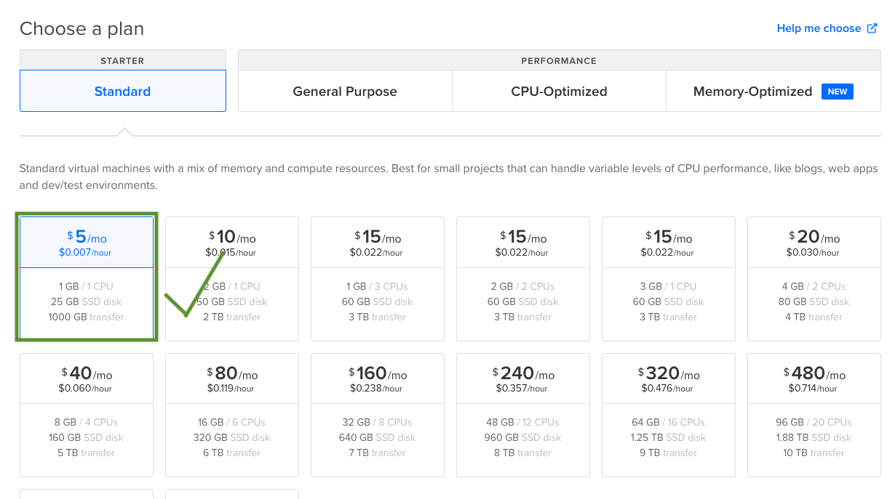
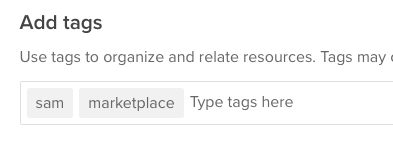

# Deploy an out of the box MeiliSearch in DigitalOcean

### Disclaimer

The current DigitalOcean image is not yet available in the marketplace.  
This steps are only addressed for MeiliSearch team (for now).  

# Create an out of the box MeiliSearch

### 1. Create a new droplet

In any DigitalOcean page, when you are logged in, you will find a menu in the upper-right corner. Click on Create -> Droplets

  

### 2. Select MeiliSearch snapshot

By default DigitalOcean will propose "distributions" tab. Select the "Snapshots" tab and look for our own MeiliSearch Debian image

  

### 3. Click on show all plans

By default, Digital Ocean propose plans that might be to expensive for our testing purposes. If you want to select the cheapest plan for testing, click on "show all plans" (bottom-left corner)

  

### 4. Select your plan

Select the cheapest plan by clicking on it

  

### 5. Select a region for your droplet

Sleect the region where you want to deploy your droplet. Remember, closer is faster, but prices can change significantly. We will choose London for this example, but it works wnywhere

  

### 6. Add your ssh key

Select your SSH key in order to be able to connet to your droplet later. If you don't see your SSH key add yours to your account.  

If you need help with this, visit [this link](https://www.digitalocean.com/docs/droplets/how-to/add-ssh-keys/to-account/)

  

### 7. Type your droplet name

Here you can select the name that will be visible everywhere in DigitalOcean account. Choose wisely!

  

### 8. Add tags

Tags are a very good method to know who created ressources, and for organizing or cleaning purposes. Try to always add some tags so other people can know who uses the machine, and for what purposes.

  

### 9. Finally click on Create Droplet

  

### 10. Your MeiliSearch is running (with no config).  

 While creating...  

 

When it's done...  

 

### 11. Test MeiliSearch.

Copy the public IP address

  

Paste it in your browser. If this screen is shown, your MeiliSearch is now ready!

  

# Configure settings in your MeiliSearch Droplet

Coming...